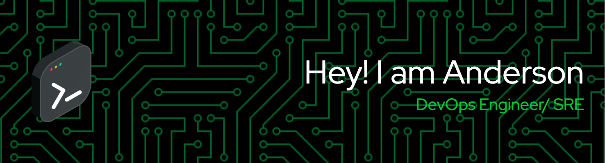

<h2 align="center">Technology Stack</h2>

  
  
  
  
  
  
  
  
  
  
  
  
  
  
  

 

<h2 align="center">Reach me out on</h2>

  
  

 

<h2 align="center">My Github Stats</h2>
 

  
  
  

 

 

 

